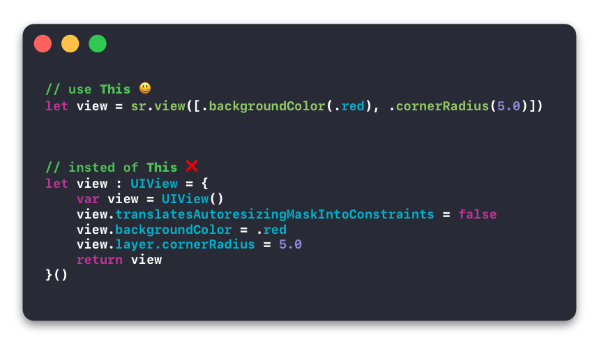

# SRView

<p align="center">
	
</p>
<!-- 
[]()
[]()
[]()
[]() -->

<p align="center">
    
    
    
    
</p>


## Getting Started

doing the UI programmatically in Swift can sometimes be annoying because you have to define all these UI letiables that return another UI class inside it, its really messed up and annoying to deal with if you ask me.
With SRView things are much simpler just define a view of type sr and add you options and you are good to go

## Installation

#### Using [CocoaPods](https://cocoapods.org)

```ruby
pod 'SRView'
```

or copy the Swift files from the [Sources](https://github.com/DevZaid/SRView/tree/master/Sources) Folder

## How to use

first thing import the SKView 

```swift
import SRView
```

#### Then

```swift
let view = sr.view([.backgroundColor(.red), .cornerRadius(5.0)]) // UIView
```

NO need to set `translatesAutoresizingMaskIntoConstraints` to `false`


#### Currently Supported UIViews

```swift
let view = sr.view()               // UIView
let image = sr.image()             // UIImageView
let label = sr.label()             // UILabel
let button = sr.button()           // UIButton
let textField = sr.textField()     // UITextField
let textView = sr.textView()       // UITextView
let slider = sr.slider()           // UISlider
let Switch = sr.Switch()           // UISwitch
let table = sr.table()             // UITableView
let collection = sr.collection()   // UICollectionView
``` 

more will be added later


#### SRView Options

must be added as an Array of options :

```swift
let textLabel = sr.label([.text("Hello World!"), .textColor(.red), .textAlignment(.center)])

// OR

let options : [SRVOptions] = [.text("click me!"), .backgroundColor(.blue), .alpha(0.7)]
let testButton = sr.button(options)
```


```swift
case alpha(CGFloat)
case numberOfLines(Int)
case backgroundColor(UIColor)
case tintColor(UIColor)
case textColor(UIColor)
case clipsToBounds(Bool)
case cornerRadius(CGFloat)
.
.
.
etc
```

for full list click [HERE](https://github.com/DevZaid/SRView/blob/master/Sources/SRVOptions.swift)

## Todo
- [ ] Add more UIViews like webView, segmentedView ... etc
- [ ] Add more options
- [ ] Make sr work as an Extension
- [ ] More Badges

## License
```
MIT License

Copyright (c) 2018 Zaid Amer

Permission is hereby granted, free of charge, to any person obtaining a copy
of this software and associated documentation files (the "Software"), to deal
in the Software without restriction, including without limitation the rights
to use, copy, modify, merge, publish, distribute, sublicense, and/or sell
copies of the Software, and to permit persons to whom the Software is
furnished to do so, subject to the following conditions:

The above copyright notice and this permission notice shall be included in all
copies or substantial portions of the Software.

THE SOFTWARE IS PROVIDED "AS IS", WITHOUT WARRANTY OF ANY KIND, EXPRESS OR
IMPLIED, INCLUDING BUT NOT LIMITED TO THE WARRANTIES OF MERCHANTABILITY,
FITNESS FOR A PARTICULAR PURPOSE AND NONINFRINGEMENT. IN NO EVENT SHALL THE
AUTHORS OR COPYRIGHT HOLDERS BE LIABLE FOR ANY CLAIM, DAMAGES OR OTHER
LIABILITY, WHETHER IN AN ACTION OF CONTRACT, TORT OR OTHERWISE, ARISING FROM,
OUT OF OR IN CONNECTION WITH THE SOFTWARE OR THE USE OR OTHER DEALINGS IN THE
SOFTWARE.
```
